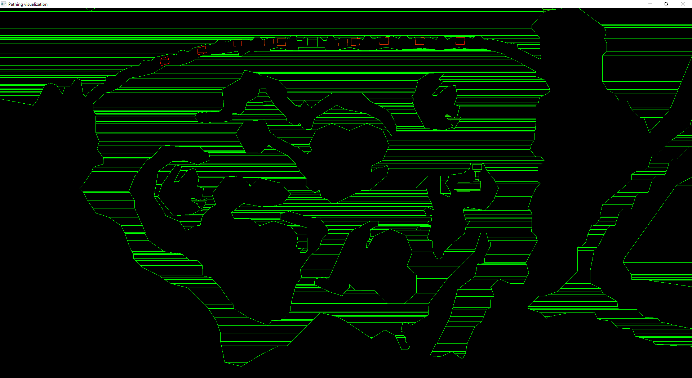

# GW Pathing Maps Visualization

A viewer for Guild Wars pathing maps.

Thanks to ACB for [https://bitbucket.org/ACB/gwpathingmaps]()

### Usage:

1. Extract pmap files from gw dat using ACB's Pathingmap Builder
2. select the file hash or path in Visualization/main.cpp (by default it's looking in PMAPs folder in Visualization directory - you have to move the pmaps there)
3. Build and run visualization

### Results

